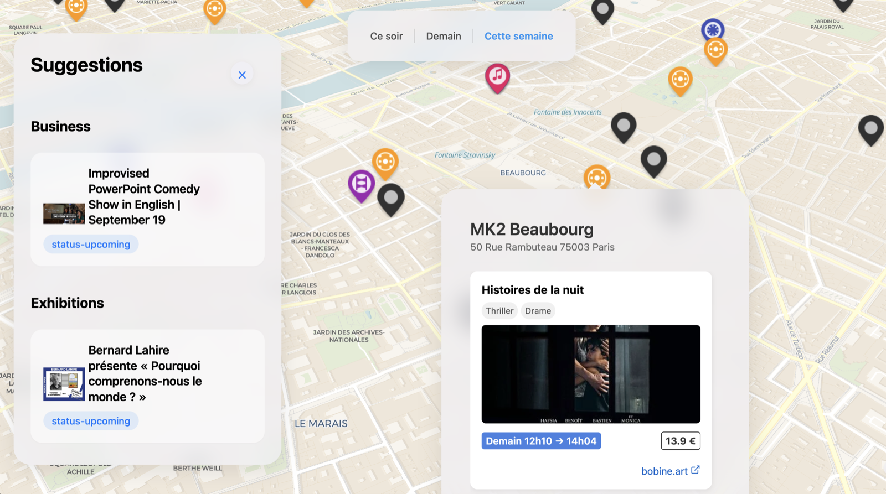
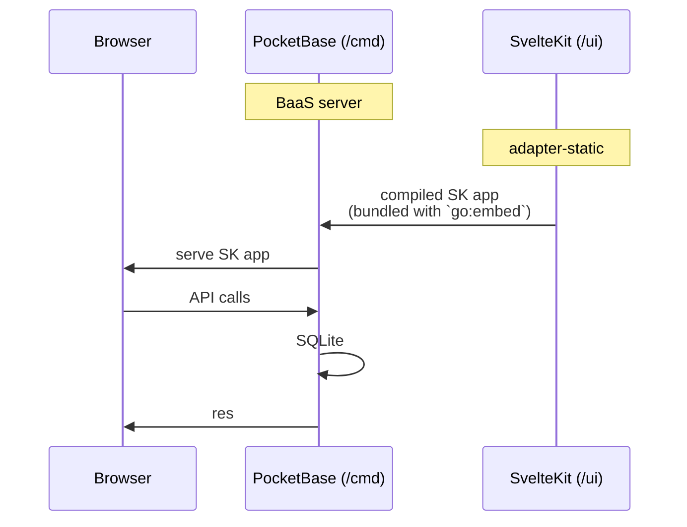
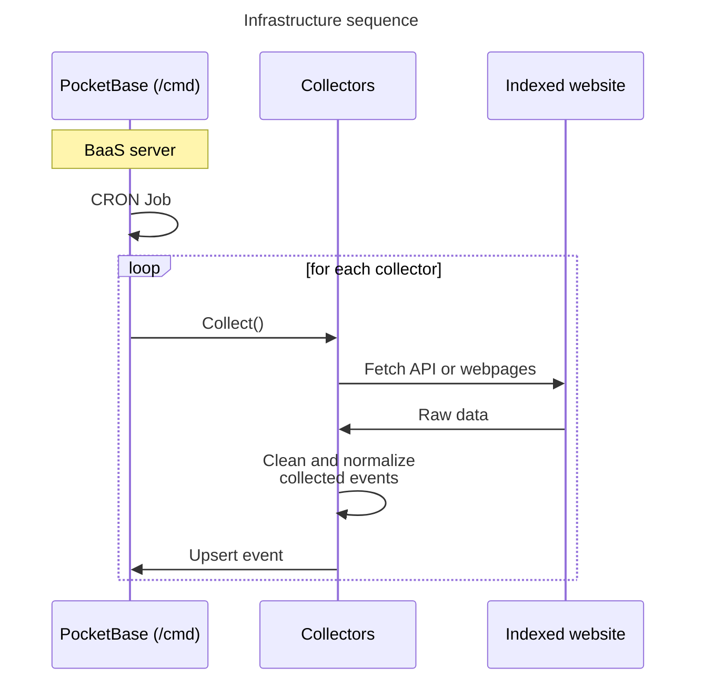

# sortir.in

<div align="center">


**Discover what's happening around you, all in one place.**

</div>

## 🌟 Overview



Sortir is an event discovery platform that aggregates and visualizes local events on an interactive map. It solves a common problem: finding interesting activities nearby shouldn't require checking multiple specialized platforms.

While existing services focus on specific niches (concerts, movies, art exhibitions) or locations, Sortir brings everything together in one unified, dynamic interface.

## ✨ Features (wip)

- 🗺️ **Interactive Map View** - Visualize all events around you at a glance
- 🎭 **Diverse Event Types** - Movies, festivals, concerts, theater, family activities, and more
- 🔍 **Smart Discovery** - Find events based on your preferences and location
- 📱 **Responsive Design** - Works seamlessly across desktop and mobile devices
- 🧭 **Activity Planning** - Create custom itineraries for exploring new cities


## ⚙️ Technical stack

### Client and server


### Data collection


## 🚀 Getting Started

### Prerequisites

Before you begin, ensure you have the following installed:
- Go 1.27+
- Node.js 18+
- pnpm (invoked through `npx`, no global install required)

### Installation

To install all dependencies, run:

```bash
make install
```

This will:
- Download Go modules
- Install modd (Go-based file watcher for development)
- Install UI dependencies using pnpm

> [!NOTE]
> Since pnpm v11, dependency build scripts must be explicitly approved.
> The allowlist lives in [`ui/pnpm-workspace.yaml`](ui/pnpm-workspace.yaml) (`allowBuilds`).
> If a new dependency ships a build script, add it there.

### Building

To build the application, run:

```bash
make build
```

This command:
- Builds the UI (if needed)
- Embeds the UI into the Go binary
- Compiles the Go application

### Development

To run the application in development mode:

```bash
make dev
```

This command:
- Builds the UI if it doesn't exist
- Uses modd to watch for file changes and automatically rebuild/restart the application

For UI-only development:

```bash
make dev-ui
```

### Populating data

The populate tool collects events for cities (in the order defined by `NewFrenchCitiesIterator`) and upserts them into the running server.

First, start the server (in a separate terminal):

```bash
make dev
```

Then populate the first city (Annemasse):

```bash
go run ./cmd/populate 1
```

Or the first 10 cities:

```bash
go run ./cmd/populate 10
```

### Cleaning

To clean build artifacts:

```bash
make clean
```

### Testing CI Locally

You can test the CI workflow locally before pushing changes using [act](https://github.com/nektos/act), a tool for running GitHub Actions locally:

1. Install Docker (required for act)
2. Install act:
   ```bash
   # macOS
   brew install act

   # Linux
   curl https://raw.githubusercontent.com/nektos/act/master/install.sh | sudo bash

   # Windows (with Chocolatey)
   choco install act-cli
   ```
3. Run the CI workflow locally:
   ```bash
   # From the repository root
   act

   # To run a specific job
   act -j build

   # To list all available actions
   act -l
   ```

## 🤝 Contributing

Contributions are welcome! Please feel free to submit a Pull Request.

## 📝 License

This project is licensed under the MIT License - see the LICENSE file for details.

## 🔮 Vision

Sortir aims to be the go-to platform for discovering what's happening around you. Unlike specialized services limited to specific event types or locations, or the static view provided by mapping services, Sortir offers a dynamic, personalized experience.

Like a search engine for local activities, it crawls, indexes, and displays events on an interactive map - from movies showing tonight at nearby theaters to temporary exhibitions closing tomorrow, concerts, festivals, and parties.

The platform learns your preferences over time and can even suggest activity itineraries for you and your friends when exploring a new city.
